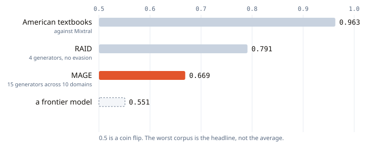

<div align="center">

<h1>
  <picture>
    <source media="(prefers-color-scheme: dark)" srcset="assets/sloptrim-logo-dark.svg">
    
  </picture>
</h1>

**A local detector for AI-writing patterns. It scores every prose file your agent
saves and asks for the flagged spans to be fixed.**
Python standard library only, no network, no model. Prose only, never code.

[](https://github.com/seyedehsanhadi/sloptrim/actions/workflows/test.yml)
[](CHANGELOG.md)
[](LICENSE.txt)
[](scripts/detect.py)
[](tests/)
[](scripts/detect.py)

[Install](#install) &middot; [What it does](#what-it-does) &middot; [Measured](#measured) &middot; [Limits](#what-it-cannot-do) &middot; [Patterns](references/patterns.md) &middot; [Ethics](ETHICS.md)

</div>

> [!IMPORTANT]
> **This is a command-line tool and an agent plugin. There is no website and no hosted version.**
> Nothing you write is uploaded, there is no account, and no text ever leaves your machine.
> Any site offering a service under this name is unrelated to this project.

<picture>
  <source media="(prefers-color-scheme: dark)" srcset="assets/demo-dark.svg">
  
</picture>

<div align="center"><sub>A recorded session, not a mock-up. <a href="record/session_capture.py">record/session_capture.py</a> fires the real hooks with the payloads Claude Code sends and writes <a href="record/session.json">record/session.json</a>; <a href="record/anim.py">record/anim.py</a> draws it. The hook lines, the scores and the milliseconds come from that capture; the grey labels beside them are narration. The prose being scored is <a href="record/draft.md">record/draft.md</a>, a short piece written for the recording.</sub></div>

---

## Install

Paste into Claude Code, Codex, Cursor, or any coding agent:

```text
Install the sloptrim plugin from https://github.com/seyedehsanhadi/sloptrim
```

Restart, then run `/sloptrim doctor`. It answers with four `[OK]` lines.

<details>
<summary>Explicit commands, and installing without the marketplace</summary>

```
/plugin marketplace add seyedehsanhadi/sloptrim
/plugin install sloptrim@sloptrim
```

```bash
git clone https://github.com/seyedehsanhadi/sloptrim.git ~/.claude/skills/sloptrim
mkdir -p ~/.claude/commands
cp ~/.claude/skills/sloptrim/install/sloptrim-command.md ~/.claude/commands/sloptrim.md
```

Do not skip the `mkdir`. On a fresh machine `~/.claude/commands` does not exist yet
and the copy fails with "No such file or directory". In PowerShell the last two lines
are `New-Item -ItemType Directory -Force $HOME/.claude/commands` and `Copy-Item`.
The copy puts `/sloptrim` in the `/` menu, because Claude Code does not scan a skill
folder's own `commands/`. A marketplace install needs no such step. Either way the
router also answers to `/sloptrim:sloptrim`.

</details>

## What it does

The score is 0-100 against 71 documented patterns. 62 of them have a detector; the
other 9 need a reading and are worked during the rewrite. Of the 62, 50 can move the
score and 12 are reported as writing advice and count for nothing: most of them because
measurement showed they mark formal register rather than machine authorship, the rest
because they are typographic habits.

| | |
|---|---|
| Formats | 20, including `.docx`, `.pptx`, `.xlsx`, OpenDocument, `.epub`, `.ipynb`, LaTeX |
| Runs in | Claude Code, on save. Other agents via `/sloptrim init`, which writes the contract to `AGENTS.md`, and `.cursor/rules/` |
| Needs | Node for the hooks, Python 3.9 or newer for the detector, nothing else |
| Suite | 97 Python tests and 53 hook checks, green in CI on Linux, Windows and macOS, against Python 3.9 and 3.13 |
| Does not see | A file written by a `Bash` command, which reaches disk without passing `Write` or `Edit` |

| Command | Effect |
|---|---|
| `/sloptrim full` | Contract + guard *(default)* |
| `/sloptrim strict` | Flags at 20 instead of 40, and asks for a character scrub |
| `/sloptrim lite` / `off` | Contract only / nothing |
| `/sloptrim check <file>` | Score a file, name the tells, no rewrite |
| `/sloptrim init` | Write the contract to `./AGENTS.md` and a Cursor rule to `./.cursor/rules/` |
| `/sloptrim doctor` | Diagnose the install |

```bash
python scripts/detect.py draft.docx    # JSON: patterns, metrics, 0-100 score
```

A score lands in one of five bands: `clean`, `light tells`, `mixed`, `heavy tells`,
`pervasive tells`. The guard nudges above 40, or above 20 in strict mode.

## Measured

**The figures below were measured against corpora held privately. Neither those
corpora nor the harness that read them is in this repository, and nothing here
recomputes any of it.** They are cited as results, with the corpus named, and cannot
be re-derived from what you have cloned.

False positives on human prose, at the default threshold, worst corpus first:

| corpus | n | rate |
|---|---|---|
| American textbooks, 30 titles | 9,333 | **0.85%** |
| MAGE human web text | 504 | **0.40%** |
| PubMed abstracts, pre-2020 | 529 | 0.00% |
| arXiv abstracts, pre-2021 | 939 | 0.00% |

Detection, ROC-AUC per corpus. The worst one is the headline:

<picture>
  <source media="(prefers-color-scheme: dark)" srcset="assets/detection-dark.svg">
  
</picture>

## What it cannot do

**It cannot tell you whether a current frontier model wrote something.** The machine
arms above come from GPT-2, GPT-J, OPT, FLAN-T5, MPT, Mistral, Mixtral, GPT-3.5 and
GPT-4, nothing newer. A run against a current frontier model measured ROC-AUC 0.551,
close to a coin flip.

**The writing contract has no measured effect.** Twenty documents drafted twice from
one brief with the switch toggled, both arms verified from the transcripts: mean
change +2.25, bootstrap 95% CI -5.65 to +9.90, sign test p = 0.27. Its banned-word
list works; nothing else in it does. That is 20 pairs against the 40 the protocol asks
for, so the question is unresolved rather than settled.

**It is not an authorship classifier and must not be used as one.** A score says
something about writing, never about a person. Read [ETHICS.md](ETHICS.md).

## License

Apache-2.0 ([full text](LICENSE.txt), [NOTICE](NOTICE)). Cite with
[CITATION.cff](CITATION.cff).
